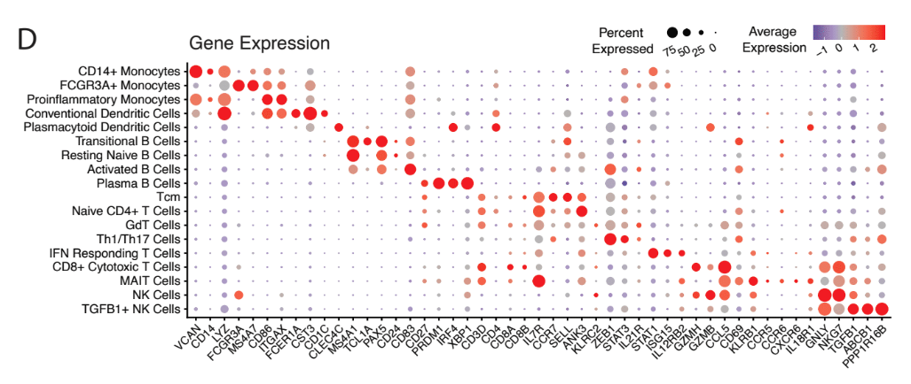
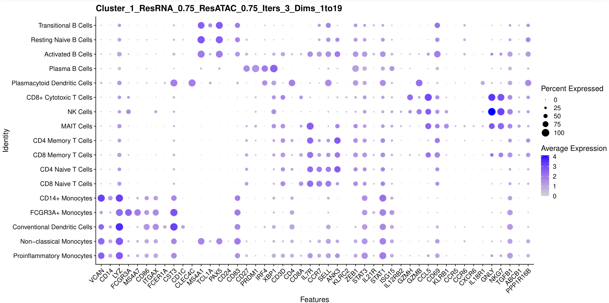
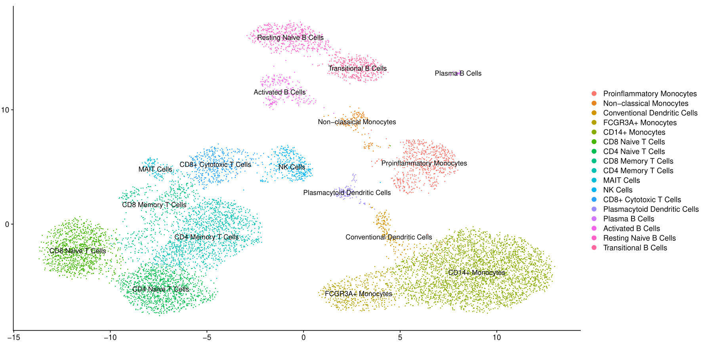

---
---
---

# Cluster Labeling Writeup

# Reference Dotplot

# Final Dotplot

## Respective UMAP

# B Cells

## Transitional B Cells

Cluster number 18 has high MS4A1 and PAX5 expression, like all other B Cells, but it also has the highest TCL1A expression out of all other B Cells.

## Resting Naive B Cells

Cluster number 17 expresses similar markers to activated B Cells, however has lower TCL1A expression and higher ANK3 expression.

## Activated B Cells

Cluster number 16 expresses ZEB1 and CD69, which are Activated B Cell markers as can be seen in the reference dotplot.

## Plasma B Cells

Cluster number 15 has high expression in clusters CD27, PRDM1, IRF4, XBP1, and CD3D, which are all associated with plasma cells in the reference dotplot.

# Dendritic Cells

## Plasmacytoid Dendritic Cells

Cluster number 14 has high expression in CST3, CLEC4C, IRF4, CD4, SELL, GZMB, and PPP1R16B, which exactly fit the pattern for Plasmacytoid Dendritic Cells in the reference dotplot.

## Conventional Dendritic Cells

Cluster number 3 has high expression for LYZ and CST3, as well as moderate expression CD86, CD1C and ITGAX. It also has low expression for FCGR3A and MS4A7. This pattern when compared to other dendritic cells showed similarities with the one of conventional dendritic cells in the reference dotplot.

# T Cells

## CD8+ Cytotoxic T Cells

Cluster number 13 expresses CD3D, CD8A, GZMH and CCL5, which math with the refence's picture expression profile for CD8+ Cytotoxic T Cells.

## CD8 Memory Cells

Cluster number 9 expresses S100A4 (Memory marker) as well as CD8A and CD8B, both CD8 markers.

## CD8 Naive Cells

Cluster number 7 expresses CCR7 (Naive marker) as well as CD8A and CD8B, both CD8 markers.

## CD4 Memory Cells

Cluster number 10 expresses S100A4 (Memory Marker) as well as the CD4 marker.

## CD4 Naive Cells

Cluster number 8 expresses CCR7 (Memory Marker) as well as the CD4 marker.

## NK Cells

Cluster number 12 expresses GNLY, NKG7, XBP1 as well as FCGR3A in a very similar pattern to the reference dotplot.

## MAIT Cells

Cluster number 11 expresses IL7R, ANK3, CCL5, KLRB1, GNLY, CCR5, CCR6, CXCR6 and IL18R1 in patterns that are strikingly similar to the reference dotplot.

# Monocytes

## CD14+ Monocytes

Out of all the monocytes, clusters number 5 and 6 showed high expression in the CD14 marker .

## FCGR3A+ Monocytes

In the monocyte section, cluster number 4 is the only one to express LYZ, FCGR3A, MS4A7, CD86 and ITGAX. It also showed low expression for CD14 and VCAN which solidified its identity as FCGR3A+ Monocytes.

## Non-Classical Monocytes (B Cell)

This population has high S100A8, LYZ (CD14 monocyte marker), however it also has high expression in the MS4A1, CD79A and CD79B markers (B Cell markers)

## Proinflammatory Monocytes
